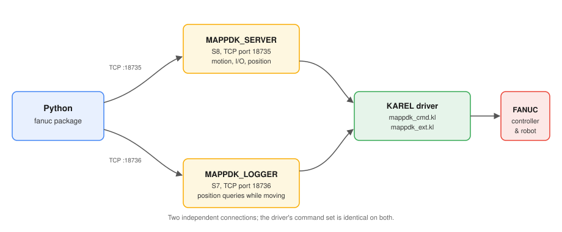

# Two connections

Two independent KAREL programs run on the controller:

| Program | tag | port | constant |
| --- | --- | --- | --- |
| `MAPPDK_SERVER` | S8 | 18735 | `protocol.DEFAULT_PORT` |
| `MAPPDK_LOGGER` | S7 | 18736 | `protocol.LOGGER_PORT` |

Comparing the two source files side by side, the main loop is
identical, both call the same `HANDLE_CMD`, and both support the
[upstream commands](commands-upstream.md) and
[extended commands](commands-extended.md) in the tables above. Only
three things differ:

- tag and port
- the logger doesn't run `TP_CLS`
- the logger doesn't set `UFRAME[8]` / `UTOOL[8]`; the server does
  that, and both setting it would conflict

So "logger" is a bit of a misleading name; it doesn't write logs. Its
purpose is to be a second connection: the main connection (S8) blocks
after sending `movej` until the move finishes, and that's when
position can be queried from the logger (S7) instead; that's exactly
how trajectory recording (`MotionTracer`) works. If you only ever use
a single connection, S7 doesn't need to be set up, see
[controller setup](../controller-setup.md).

---
*Last updated: 2026-08-31*
